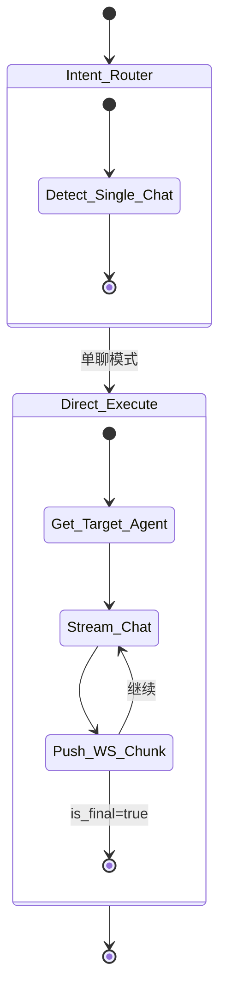

# AgentHub - Agent 协作状态流转设计

> 文档版本：v1.0
> 最后更新：2026-05-27
> 状态机引擎：LangGraph (Python)

---

## 1. 协作模型整体架构 (Orchestrator Top-View)

### 1.1 双模式分流

```
用户消息输入
       │
       ▼
┌─────────────────────────────────────────────────────────┐
│                    模式判定                               │
│  ─────────────────────────────────────────────────────  │
│  单聊模式：session.type == "single"                      │
│  群聊模式：session.type == "group" 或 @多个Agent          │
└───────────┬─────────────────────────────┬───────────────┘
            │                             │
            ▼                             ▼
┌───────────────────────┐     ┌───────────────────────────┐
│   单聊旁路转发         │     │   群聊 DAG 编排            │
│                       │     │                           │
│ 消息直接路由至目标     │     │ 消息被 Orchestrator 拦截   │
│ Expert Agent 适配器   │     │ 转化为 DAG 状态机驱动      │
│                       │     │                           │
│ 无任务拆解            │     │ 任务拆解 → 专家分配 →      │
│ 无并发调度            │     │ 并发执行 → 结果聚合        │
└───────────────────────┘     └───────────────────────────┘
```

### 1.2 模式判定规则

| 条件 | 模式 | 路由目标 |
|------|------|----------|
| `session.type == "single"` | 单聊 | 直接旁路至 `session.agent_ids[0]` |
| `session.type == "group"` | 群聊 | 进入 Orchestrator DAG |
| 用户消息包含 `@agent_id` 且数量 > 1 | 群聊 | 进入 Orchestrator DAG |
| 用户消息包含 `@agent_id` 且数量 == 1 | 单聊 | 直接旁路至指定 Agent |

---

## 2. LangGraph 状态机图形描述 (Mermaid State Chart)

### 2.1 群聊模式完整状态流转

```mermaid
stateDiagram-v2
    [*] --> Intent_Router : 用户消息进入

    state Intent_Router {
        [*] --> Analyze_Input
        Analyze_Input --> Single_Chat_Check : 分析意图
        Single_Chat_Check --> Direct_Execute : 单聊模式
        Single_Chat_Check --> Task_Decomposer : 群聊模式
    }

    Direct_Execute --> [*] : 流式输出完成

    state Task_Decomposer {
        [*] --> Decompose_Task
        Decompose_Task --> Generate_Task_Tree
        Generate_Task_Tree --> Validate_Dependencies
        Validate_Dependencies --> [*]
    }

    Task_Decomposer --> Agent_Selector : 任务树生成

    state Agent_Selector {
        [*] --> Match_Agent_Capability
        Match_Agent_Capability --> Assign_Task
        Assign_Task --> Check_All_Assigned
        Check_All_Assigned --> [*] : 全部分配完成
        Check_All_Assigned --> Match_Agent_Capability : 继续分配
    }

    Agent_Selector --> Expert_Execution_Loop : 分配完成

    state Expert_Execution_Loop {
        [*] --> Acquire_Session_Lock

        Acquire_Session_Lock --> Execute_Agent_A : 获取锁成功
        Acquire_Session_Lock --> Lock_Retry : 获取锁失败

        Lock_Retry --> Acquire_Session_Lock : 重试
        Lock_Retry --> Execution_Failed : 超过重试次数

        state Execute_Agent_A {
            [*] --> Stream_Chat
            Stream_Chat --> Push_WS_Chunk : 生成 chunk
            Push_WS_Chunk --> Stream_Chat : 继续生成
            Stream_Chat --> Agent_Complete : is_final=true
            Agent_Complete --> [*]
        }

        Execute_Agent_A --> Execute_Agent_B : Agent A 完成
        Execute_Agent_B --> Release_Session_Lock : 全部完成

        Release_Session_Lock --> [*]
        Execution_Failed --> [*]
    }

    Expert_Execution_Loop --> Result_Aggregator : 执行完成
    Expert_Execution_Loop --> Error_Handler : 执行失败

    state Result_Aggregator {
        [*] --> Collect_Artifacts
        Collect_Artifacts --> Merge_Conflicts_Check
        Merge_Conflicts_Check --> [*] : 无冲突
        Merge_Conflicts_Check --> Conflict_Resolver : 存在冲突
        Conflict_Resolver --> [*]
    }

    Result_Aggregator --> Output_Stream : 聚合完成

    Output_Stream --> [*] : 推送完成

    state Error_Handler {
        [*] --> Classify_Error
        Classify_Error --> Push_Error_Card
        Push_Error_Card --> Check_Recoverable
        Check_Recoverable --> Intent_Router : 可恢复，重试
        Check_Recoverable --> [*] : 不可恢复，终止
    }
```



### 2.2 单聊模式简化流转



---

## 3. 节点行为与状态定义 (State & Node Definitions)

### 3.1 GraphState 共享状态结构

```python
# backend/app/agents/graph_state.py

from typing import List, Optional, Dict, Any
from pydantic import BaseModel, Field
from enum import Enum


class TaskStatus(str, Enum):
    PENDING = "pending"
    RUNNING = "running"
    COMPLETED = "completed"
    FAILED = "failed"


class TaskNode(BaseModel):
    task_id: str
    description: str
    assigned_agent_id: str
    dependencies: List[str] = Field(default_factory=list)
    status: TaskStatus = TaskStatus.PENDING
    result: Optional[Dict[str, Any]] = None
    error: Optional[str] = None


class ErrorEntry(BaseModel):
    error_code: str
    error_message: str
    recoverable: bool
    node_name: str
    timestamp: str


class GraphState(BaseModel):
    """LangGraph 状态机全局共享状态"""

    # 输入
    input_message: str
    session_id: str
    session_type: str  # "single" | "group"
    sender_id: str

    # 意图路由
    intent: Optional[str] = None  # "single_chat" | "group_chat"
    target_agent_id: Optional[str] = None

    # 任务分解
    tasks_list: List[TaskNode] = Field(default_factory=list)

    # 执行状态
    active_agent_id: Optional[str] = None
    current_task_index: int = 0

    # 产物聚合
    compiled_artifacts: List[Dict[str, Any]] = Field(default_factory=list)

    # 错误处理
    error_stack: List[ErrorEntry] = Field(default_factory=list)
    retry_count: int = 0
    max_retries: int = 3
```

### 3.2 Intent_Router 节点

```python
# backend/app/agents/nodes/intent_router.py

from ..graph_state import GraphState
from ..base_adapter import BaseAdapter, Message


async def intent_router(state: GraphState) -> GraphState:
    """意图路由节点：分析用户输入，决定单聊/群聊路径"""

    # 单聊模式直接旁路
    if state.session_type == "single":
        state.intent = "single_chat"
        state.target_agent_id = state.session_id  # 从 session 获取默认 agent
        return state

    # 群聊模式：分析是否 @ 特定 Agent
    mentions = extract_mentions(state.input_message)

    if len(mentions) == 1:
        state.intent = "single_chat"
        state.target_agent_id = mentions[0]
        return state

    # 复杂指令：进入群聊编排
    state.intent = "group_chat"

    # 调用 LLM 分析意图复杂度
    llm = get_intent_classifier()
    analysis = await llm.stream_chat([
        Message(role="system", content=INTENT_CLASSIFIER_PROMPT),
        Message(role="user", content=state.input_message)
    ])

    state.intent = parse_intent(analysis)
    return state
```

**判定逻辑**：

| 输入特征 | 路由结果 |
|----------|----------|
| 单聊 session | → `single_chat` |
| 群聊 + 仅 @1个Agent | → `single_chat` |
| 群聊 + @多个Agent | → `group_chat` |
| 群聊 + 复杂复合指令 | → `group_chat` |

### 3.3 Task_Decomposer 节点

```python
# backend/app/agents/nodes/task_decomposer.py

from ..graph_state import GraphState, TaskNode, TaskStatus
import uuid


async def task_decomposer(state: GraphState) -> GraphState:
    """任务拆解节点：将复杂任务分解为原子 Task 树"""

    decomposer = get_task_decomposer()

    # 调用 LLM 拆解任务
    response = await decomposer.stream_chat([
        Message(role="system", content=TASK_DECOMPOSER_PROMPT),
        Message(role="user", content=state.input_message)
    ])

    # 解析任务树
    raw_tasks = parse_task_tree(response)

    # 构建 TaskNode 列表
    state.tasks_list = [
        TaskNode(
            task_id=str(uuid.uuid4()),
            description=task["description"],
            assigned_agent_id=task["agent_id"],
            dependencies=task.get("dependencies", []),
            status=TaskStatus.PENDING
        )
        for task in raw_tasks
    ]

    return state
```

**任务拆解示例**：

```
用户输入："帮我做一个带登录功能的 Todo 应用并部署"

拆解结果：
├── Task 1: 数据库设计 (后端工程师)
├── Task 2: Auth API 开发 (后端工程师) [依赖: Task 1]
├── Task 3: Todo API 开发 (后端工程师) [依赖: Task 1]
├── Task 4: 登录页面 (前端工程师) [依赖: Task 2]
├── Task 5: Todo 页面 (前端工程师) [依赖: Task 3]
└── Task 6: 联调部署 (DevOps 工程师) [依赖: Task 4, Task 5]
```

### 3.4 Agent_Selector 节点

```python
# backend/app/agents/nodes/agent_selector.py

from ..graph_state import GraphState


async def agent_selector(state: GraphState) -> GraphState:
    """专家智能体路由节点：为每个 Task 匹配最佳 Agent"""

    agent_registry = get_agent_registry()

    for task in state.tasks_list:
        if task.assigned_agent_id:
            # 已由 Task_Decomposer 分配
            continue

        # 基于能力匹配
        best_agent = match_agent_capability(
            task_description=task.description,
            available_agents=agent_registry
        )
        task.assigned_agent_id = best_agent.id

    return state
```

**能力匹配矩阵**：

| 任务关键词 | 匹配 Agent |
|-----------|-----------|
| 前端/页面/组件/样式 | `codex` |
| 后端/API/数据库/接口 | `claude_code` |
| 部署/Docker/CI/CD | `opencode` |
| 设计/UI/UX | `codex` (fallback) |

### 3.5 Expert_Execution_Loop 节点

```python
# backend/app/agents/nodes/expert_execution.py

from ..graph_state import GraphState, TaskStatus, ErrorEntry
from ..base_adapter import Message
from ...core.redis import redis_client
from ...core.exception_handler import GlobalExceptionHandler
from datetime import datetime


async def expert_execution_loop(state: GraphState) -> GraphState:
    """流式执行环路：调用 BaseAdapter 派生类执行任务"""

    session_id = state.session_id

    # 获取分布式锁
    lock_key = f"agenthub:lock:session:{session_id}"
    lock_acquired = await redis_client.set(
        lock_key,
        "orchestrator_instance",
        nx=True,
        ex=5
    )

    if not lock_acquired:
        state.error_stack.append(ErrorEntry(
            error_code="LOCK_CONFLICT",
            error_message="Another orchestrator is processing this session",
            recoverable=True,
            node_name="Expert_Execution_Loop",
            timestamp=datetime.utcnow().isoformat()
        ))
        return state

    try:
        # 按依赖顺序执行任务
        for task in state.tasks_list:
            if task.status == TaskStatus.COMPLETED:
                continue

            # 检查依赖是否完成
            deps_completed = all(
                get_task_by_id(t_id, state.tasks_list).status == TaskStatus.COMPLETED
                for t_id in task.dependencies
            )
            if not deps_completed:
                continue

            # 执行任务
            task.status = TaskStatus.RUNNING
            state.active_agent_id = task.assigned_agent_id

            try:
                adapter = get_adapter(task.assigned_agent_id)

                # 构建上下文消息
                context_messages = build_context_messages(state, task)

                # 流式调用
                full_response = []
                async for chunk in adapter.stream_chat(context_messages):
                    full_response.append(chunk)
                    # 通过 WebSocket 推送 chunk
                    await push_ws_chunk(state.session_id, chunk)

                task.status = TaskStatus.COMPLETED
                task.result = {"chunks": [c.model_dump() for c in full_response]}

            except TimeoutError as e:
                task.status = TaskStatus.FAILED
                state.error_stack.append(ErrorEntry(
                    error_code="TIMEOUT",
                    error_message=str(e),
                    recoverable=True,
                    node_name="Expert_Execution_Loop",
                    timestamp=datetime.utcnow().isoformat()
                ))

            except Exception as e:
                task.status = TaskStatus.FAILED
                state.error_stack.append(ErrorEntry(
                    error_code="AGENT_EXECUTION_ERROR",
                    error_message=str(e),
                    recoverable=False,
                    node_name="Expert_Execution_Loop",
                    timestamp=datetime.utcnow().isoformat()
                ))

    finally:
        # 释放锁
        await redis_client.delete(lock_key)

    return state
```

### 3.6 Result_Aggregator 节点

```python
# backend/app/agents/nodes/result_aggregator.py

from ..graph_state import GraphState


async def result_aggregator(state: GraphState) -> GraphState:
    """产物汇聚与冲突检查节点"""

    # 收集所有完成的 Task 产物
    state.compiled_artifacts = [
        task.result
        for task in state.tasks_list
        if task.status == TaskStatus.COMPLETED and task.result
    ]

    # 冲突检查：同一文件的多次修改
    conflicts = detect_file_conflicts(state.compiled_artifacts)

    if conflicts:
        # 解决冲突：以最后一次修改为准
        state.compiled_artifacts = resolve_conflicts(
            state.compiled_artifacts,
            conflicts
        )

    return state
```

### 3.7 Output_Stream 节点

```python
# backend/app/agents/nodes/output_stream.py

from ..graph_state import GraphState


async def output_stream(state: GraphState) -> GraphState:
    """通过 WebSocket 向前端推送最终聚合结果"""

    # 推送聚合状态卡片
    await push_ws_message(state.session_id, {
        "type": "orchestrator_status",
        "payload": {
            "session_id": state.session_id,
            "status": "completed",
            "summary": generate_execution_summary(state)
        }
    })

    return state
```

---

## 4. 并发调度与分布式冲突处理规范 (Concurrency & Lock)

### 4.1 写入冲突场景

```
场景：群聊模式下，Agent A 和 Agent B 同时完成任务，尝试写入同一会话

时间线：
  T1: Agent A 完成 → 尝试写入 messages 表
  T2: Agent B 完成 → 尝试写入 messages 表
  T3: 两个 INSERT 并发执行 → 可能导致消息顺序混乱
```

### 4.2 Redis 分布式锁机制

```
┌─────────────────────────────────────────────────────────────────┐
│                    Redis 分布式锁流程                            │
│  ─────────────────────────────────────────────────────────────  │
│                                                                 │
│  Orchestrator 获取锁                                           │
│  ┌─────────────────────────────────────────────────────────┐   │
│  │  SET agenthub:lock:session:{session_id} NX EX 5         │   │
│  └─────────────────────────────────────────────────────────┘   │
│         │                                                       │
│         ├── 成功 → 执行 Agent A → 执行 Agent B → 释放锁        │
│         │                                                       │
│         └── 失败 → 等待重试 (最多 3 次，间隔 500ms)             │
│                                                                 │
└─────────────────────────────────────────────────────────────────┘
```

### 4.3 锁实现代码

```python
# backend/app/core/session_lock.py

import asyncio
from typing import Optional
from .redis import redis_client


class SessionLock:
    """会话级分布式锁"""

    def __init__(self, session_id: str, ttl: int = 5):
        self.session_id = session_id
        self.key = f"agenthub:lock:session:{session_id}"
        self.ttl = ttl
        self.acquired = False

    async def acquire(self, max_retries: int = 3, retry_interval: float = 0.5) -> bool:
        """获取锁"""
        for attempt in range(max_retries):
            result = await redis_client.set(
                self.key,
                f"instance_{id(self)}",
                nx=True,
                ex=self.ttl
            )
            if result:
                self.acquired = True
                return True
            await asyncio.sleep(retry_interval)
        return False

    async def release(self):
        """释放锁"""
        if self.acquired:
            await redis_client.delete(self.key)
            self.acquired = False

    async def __aenter__(self):
        if not await self.acquire():
            raise ConcurrentDispatchError(
                f"Failed to acquire lock for session {self.session_id}"
            )
        return self

    async def __aexit__(self, exc_type, exc_val, exc_tb):
        await self.release()
        return False


class ConcurrentDispatchError(Exception):
    """并发调度冲突异常"""
    pass
```

### 4.4 使用示例

```python
# 在 Expert_Execution_Loop 中使用

async def expert_execution_loop(state: GraphState) -> GraphState:
    async with SessionLock(state.session_id) as lock:
        for task in state.tasks_list:
            if task.status != TaskStatus.PENDING:
                continue

            adapter = get_adapter(task.assigned_agent_id)
            async for chunk in adapter.stream_chat(build_messages(state)):
                await push_ws_chunk(state.session_id, chunk)

            task.status = TaskStatus.COMPLETED

    return state
```

### 4.5 锁超时与降级策略

| 场景 | 处理方式 |
|------|----------|
| 锁获取失败 (3次重试后) | 推送 `LOCK_CONFLICT` 错误卡片，提示用户稍后重试 |
| 锁持有期间 Agent 崩溃 | TTL 5秒后自动释放，下次请求可正常获取 |
| 锁续期 (长任务) | 每 2 秒续期一次，防止长任务执行期间锁过期 |

```python
# 锁续期任务
async def extend_lock_ttl(session_id: str, lock: SessionLock):
    """后台任务：每 2 秒续期锁 TTL"""
    while lock.acquired:
        await asyncio.sleep(2)
        if lock.acquired:
            await redis_client.expire(lock.key, lock.ttl)
```

---

## 附录：状态流转检查清单

| 检查项 | 状态 |
|--------|------|
| 单聊模式旁路转发逻辑 | ✅ 无 DAG 开销 |
| 群聊模式 DAG 状态机完整性 | ✅ 6 个核心节点 |
| GraphState 结构定义 | ✅ Pydantic BaseModel |
| 流式执行异常捕获 | ✅ 转换为 ErrorEntry |
| Redis 分布式锁实现 | ✅ SessionLock 上下文管理器 |
| 锁超时自动释放 | ✅ TTL 5s |
| 锁续期机制 | ✅ 每 2s 续期 |
| 错误卡片 WebSocket 推送 | ✅ 符合 ws_messages.json 契约 |
